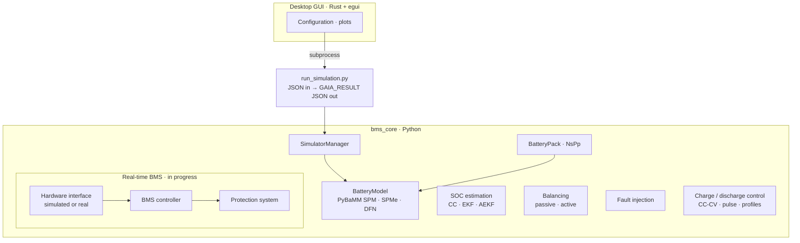

<div align="center">

# GAIA

**A battery management system (BMS) simulator: physics-based lithium-ion cell models underneath,
BMS algorithms on top, and a Rust desktop GUI.**

PyBaMM electrochemistry (SPM · SPMe · DFN) · SOC estimation (Coulomb counting · EKF · AEKF) · pack modelling ·
balancing · protection · fault injection · charge control


-1E9E6A)


</div>

---

## The problem

A BMS decides when a battery may charge, how hard it may discharge, which cell needs balancing
and when to open the contactor. Developing and validating that logic runs into the same walls:

| # | Problem | What it costs | How GAIA approaches it |
|---|---|---|---|
| 1 | **Real cells are slow to test against.** A single 1C cycle takes about two hours; an ageing or temperature study takes weeks. | Algorithm iterations are paced by the battery, not the engineer. | A full charge or discharge simulates in seconds, so a SOC estimator or charge profile can be iterated on in minutes. |
| 2 | **The interesting cases are destructive.** Internal shorts, over-temperature and thermal runaway can't be provoked on a bench without risking the cell, the rig, or the lab. | Fault handling is the least tested part of most BMS code. | **Fault injection**: ten fault types (cell short, open circuit, over/under-voltage, over-current, over-temperature, resistance increase, capacity fade, thermal runaway, connection failure) applied to simulated cells. |
| 3 | **Toy battery models hide the physics.** A linear voltage curve or a fixed resistor model has no rate-dependent polarisation and no chemistry-specific open-circuit voltage. | Algorithms tuned on toy models break on real cells, and the flat LFP plateau defeats voltage-based SOC. | Cells are simulated with **PyBaMM's electrochemical models** (single particle, single particle with electrolyte, Doyle-Fuller-Newman) using published parameter sets per chemistry. |
| 4 | **Cell model and BMS logic live in different tools.** | Glue code, unit mismatches, and no single place to see cause and effect. | One Python package with the cell model, pack model, SOC estimation, balancing, protection and charge control, plus a Rust GUI on top. |

**Who it is for:** BMS and battery engineers prototyping algorithms, students learning how a BMS
works, and anyone who needs realistic Li-ion behaviour without lab hardware.

---

## Results

Both figures below are real GAIA simulations. Regenerate them with `python assets/make_figures.py`.

| Chemistry matters | Current matters |
|---|---|
|  |  |
| LFP's flat plateau (why voltage alone is a poor SOC sensor for LFP), NCA's steep knee near empty, and NMC's gradual slope, from published PyBaMM parameter sets. | Higher current means more polarisation and a lower terminal voltage at the same charge delivered: the effect a BMS current limit has to respect. |

---

## Status

Checked on 2026-10-05 with Python 3.12 and PyBaMM 26.9.

| Component | Module | Status |
|---|---|---|
| Electrochemical cell simulation (SPM / SPMe / DFN; NMC, LFP, NCA, LMO, LTO) | `battery_model.py`, `simulation_manager.py` | ✅ Works. Voltage, SOC, current and temperature, sampled on a dense time grid |
| SOC estimation: Coulomb counting, Kalman filter, adaptive EKF | `soc_estimation.py` | ✅ Works. The filters use a generic OCV curve, not the selected chemistry's |
| Fault injection, 10 fault types with severity and start time | `fault_injection.py` | ✅ Works on cell state |
| Charge / discharge control: CC, CV, CC-CV, fast, trickle, pulse; CC / CP / CR / profile | `charging_discharging_simulation.py` | ✅ Works step by step |
| Series-parallel pack model (`NsPp`) with cell-level state and imbalance statistics | `battery_pack.py` | ✅ Works |
| Passive and active balancing | `battery_balancing.py` | ⚠️ Detects SOC imbalance, but acts on voltage difference only |
| Real-time BMS engine: hardware interface → BMS controller → protection | `simulation_engine.py`, `bms_controller.py`, `protection_system.py`, `hardware_interface.py` | 🚧 Runs, but pack-level SOC and temperature are not yet physically consistent (see Roadmap) |
| Desktop GUI (Rust, egui) driving the Python simulation | `gui_rust/`, `Scripts/run_simulation.py` | ✅ Builds and launches |
| Thermal behaviour | (PyBaMM option) | Cells are isothermal by default; a lumped thermal model is available in PyBaMM but not wired in yet |
| Automated tests | | None yet |

---

## Architecture



---

## Quick start

GAIA needs **Python 3.9 to 3.12**, because PyBaMM does not support 3.13 yet.

```bash
git clone https://github.com/Alifizz01/GAIA && cd GAIA
py -3.12 -m venv .venv            # Windows; on Linux/macOS: python3.12 -m venv .venv
.venv\Scripts\activate            # Linux/macOS: source .venv/bin/activate
pip install numpy scipy pybamm pandas joblib pyyaml matplotlib
```

Simulate a one-hour 1C discharge:

```python
import sys; sys.path.insert(0, "Scripts")
from bms_core import SimulatorManager

sim = SimulatorManager("SPMe", "NMC", 298.15)      # model, chemistry, temperature [K]
sim.run_battery_simulation(3600)                   # seconds
t, voltage, soc, temperature, current = sim.get_simulation_results()
print(f"{voltage[0]:.2f} V -> {voltage[-1]:.2f} V, SOC {soc[0]:.0f} % -> {soc[-1]:.0f} %")
# 4.08 V -> 3.40 V, SOC 100 % -> 0 %
```

### The BMS building blocks

```python
from bms_core import (SOCEstimator, SOCEstimationMethod, FaultInjector, Fault, FaultType,
                      ChargeDischargeSimulator, ChargingProfile, ChargingMode)

# SOC: adaptive extended Kalman filter fed with current and voltage
est = SOCEstimator(method=SOCEstimationMethod.AEKF, nominal_capacity=50.0, initial_soc=100.0)
for _ in range(600):
    soc = est.update(current=25.0, voltage=3.95, dt=1.0)

# Faults: a 50 % severity internal short on cell (0, 0) from t = 10 s
fi = FaultInjector()
fi.inject_fault(Fault(fault_type=FaultType.CELL_SHORT, cell_position=(0, 0), severity=0.5, start_time=10.0))
print(fi.apply_faults({"voltage": 3.7, "current": 0.0, "temperature": 298.15}, current_time=15.0))
# {'voltage': 3.45, ...}

# Charging: one step of a CC-CV profile
cccv = ChargingProfile(mode=ChargingMode.CONSTANT_CURRENT_CONSTANT_VOLTAGE,
                       cc_current=1.0, cv_voltage=4.2, termination_current=0.05)
step = ChargeDischargeSimulator(charging_profile=cccv).simulate_charging_step(
    voltage=3.8, soc=50.0, temperature=298.15, dt=1.0, nominal_capacity=50.0)
print(step)   # {'current': -50.0, 'phase': 'cc', ...}
```

### From the command line, or from another program

`run_simulation.py` takes JSON and prints one `GAIA_RESULT:{...}` line, which is how the Rust GUI talks to Python:

```bash
python Scripts/run_simulation.py --params '{"model_type": "SPM", "chemistry": "LFP", "duration": 1800}'
```

### Desktop GUI

```bash
cd gui_rust
cargo build --release
cargo run --release      # needs `python` on PATH with PyBaMM installed (the venv above)
```

---

## Repository layout

```
Scripts/
  bms_core/            the framework: cell and pack models, SOC, balancing, protection, faults, charging
  run_simulation.py    JSON bridge used by the GUI
  data/                sample cell data and battery specs
gui_rust/              desktop GUI (Rust, egui / eframe)
assets/                README figures and the script that regenerates them
config_example.json    example configuration for ConfigManager
```

---

## Roadmap

- **Real-time BMS engine:** make pack-level SOC, energy and temperature physically consistent, and
  verify that the protection system trips on over-temperature and over-current
- **Balancing on SOC**, not only voltage, so it also works on flat-OCV chemistries like LFP
- **Chemistry-aware SOC filters:** use each chemistry's open-circuit voltage curve from PyBaMM
- **Thermal model:** enable PyBaMM's lumped thermal option so temperature responds to current
- **Tests and CI:** regression tests against the figures above, run on every push
- **GUI:** live pack view, fault-injection controls, and CSV export

## Built with

[PyBaMM](https://pybamm.org) for the electrochemistry, NumPy and SciPy, and
[egui](https://github.com/emilk/egui) for the desktop interface.

## License

MIT, see [LICENSE](LICENSE).
