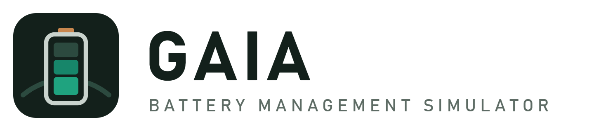
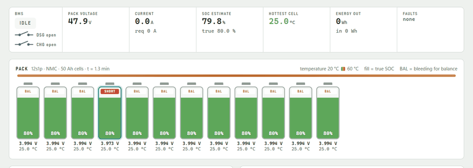
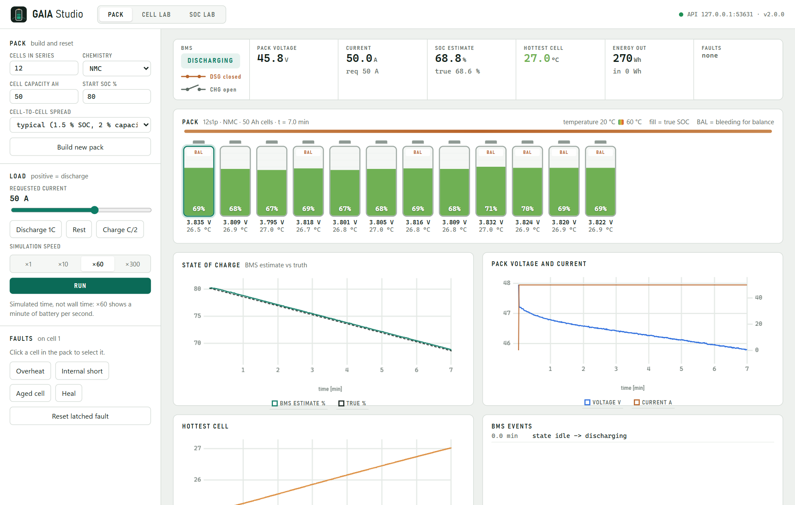
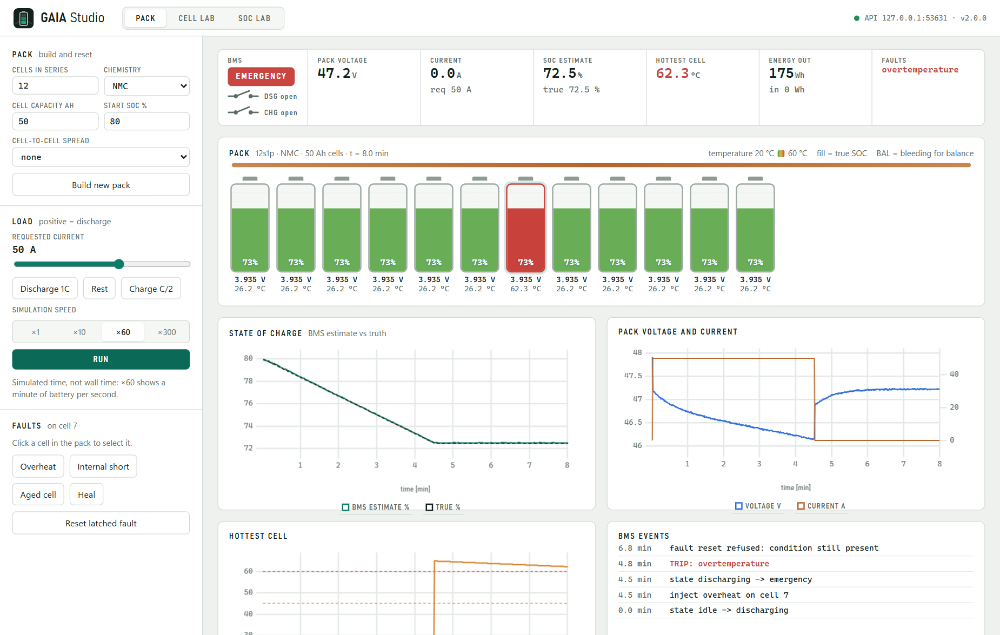
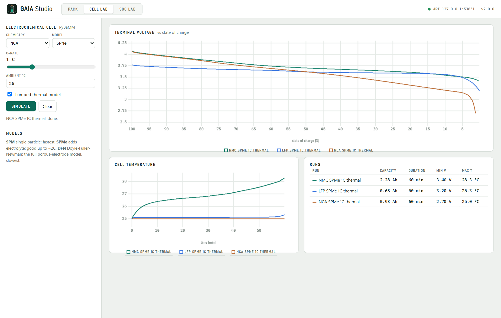
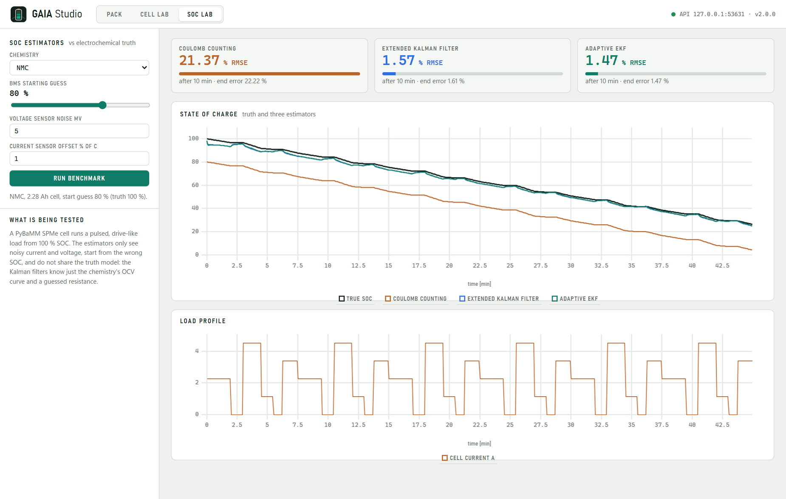
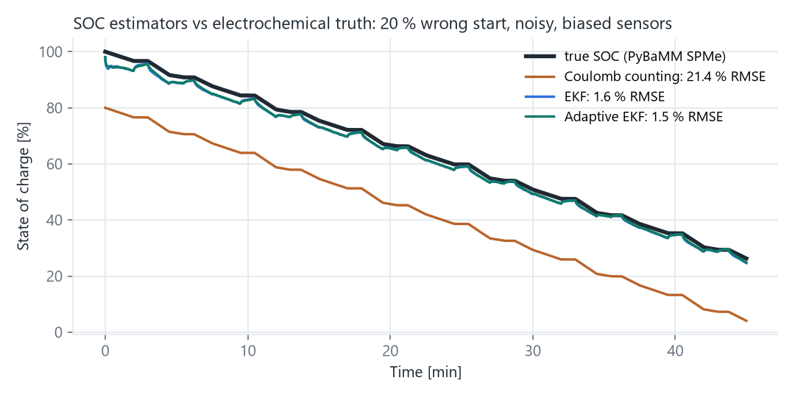
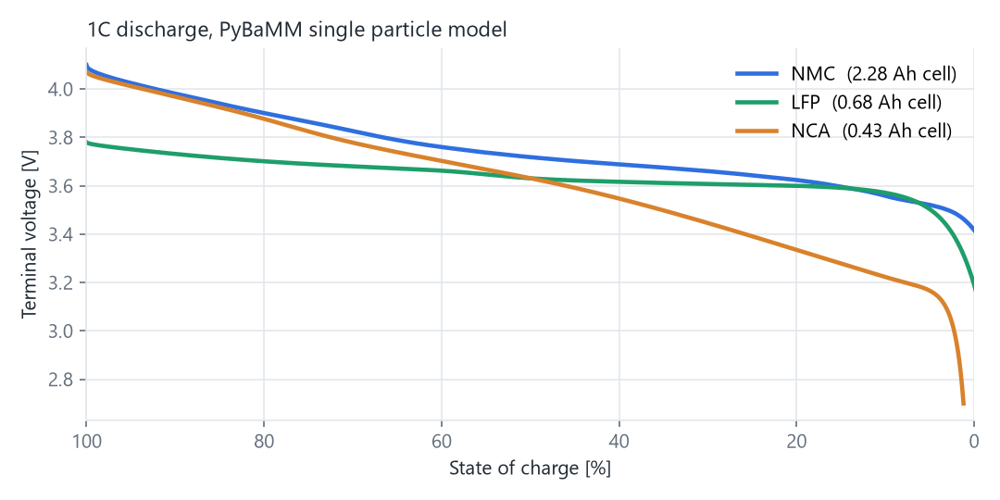
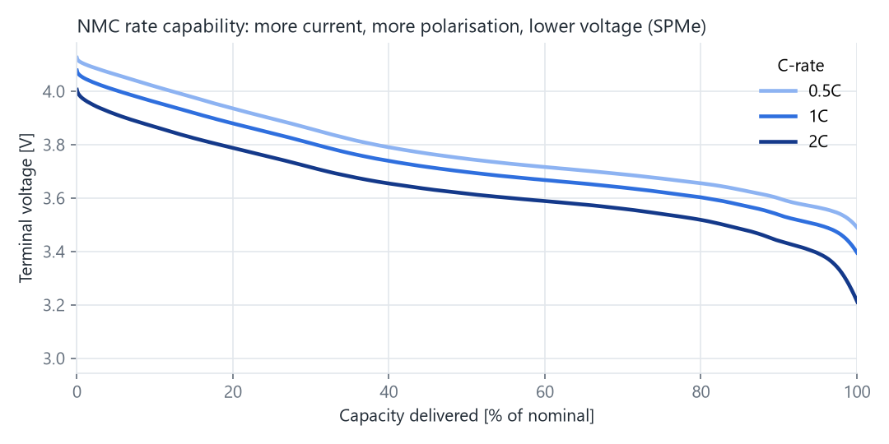
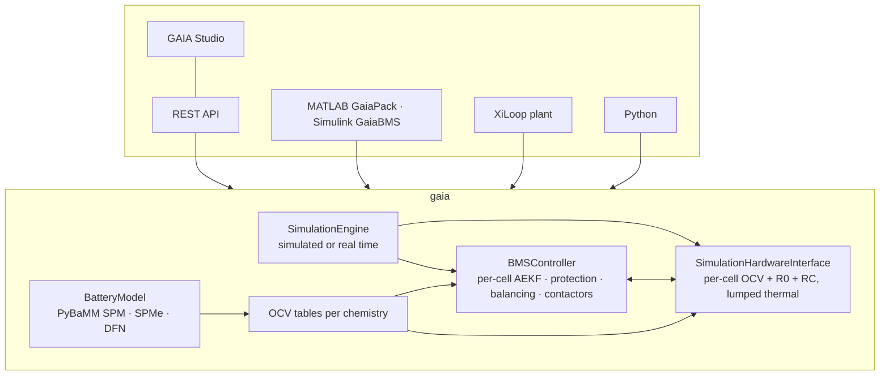

<div align="center">

<picture>
  <source media="(prefers-color-scheme: dark)" srcset="assets/logo-dark.png">
  
</picture>

**A battery management system simulator: PyBaMM electrochemistry for the cells, a real BMS on top
(SOC estimation, protection, balancing, contactors), and a desktop studio to watch it work.**

[](https://github.com/Alifizz01/GAIA/actions/workflows/ci.yml)

-2F6FDE)




<sub>An internal short drains cell 4 on its own. The BMS sees it only as an imbalance and bleeds the eleven healthy cells
down to match: the reason internal shorts are dangerous to miss.</sub>

</div>

---

## The problem

A BMS decides when a battery may charge, how hard it may discharge, which cell needs balancing and
when to open the contactor. Developing and validating that logic runs into the same walls:

| # | Problem | What it costs | How GAIA approaches it |
|---|---|---|---|
| 1 | **Real cells are slow to test against.** A single 1C cycle takes about two hours; an ageing or temperature study takes weeks. | Algorithm iterations are paced by the battery, not the engineer. | Packs run in **simulated time**: an hour of battery in a few seconds of CPU, deterministic and repeatable. |
| 2 | **The interesting cases are destructive.** Over-temperature, internal shorts and over-discharge can't be provoked on a bench without risking the cell, the rig or the lab. | Fault handling is the least tested part of most BMS code. | **Fault injection** on any cell (overheat, internal short, capacity fade) against a BMS whose protections really open the contactors, latch, and refuse to reset while the condition is still present. |
| 3 | **Toy battery models hide the physics.** A linear voltage curve has no rate-dependent polarisation and no chemistry-specific OCV. | Algorithms tuned on toy models break on real cells, and LFP's flat plateau defeats voltage-based SOC. | Cells come from **PyBaMM's electrochemical models** (SPM, SPMe, DFN) with published parameter sets; the real-time pack uses OCV tables generated from those same models. |
| 4 | **"Is my SOC estimator any good?" is rarely measured honestly.** Filters are usually tested against the same model they contain. | Optimistic accuracy claims that collapse on hardware. | A **benchmark against electrochemical truth**: a PyBaMM cell, noisy and biased sensors, a 20 % wrong starting SOC, and estimators that do not share the truth model. |
| 5 | **The BMS lives apart from the rest of the toolchain.** | Control engineers in Simulink, test engineers in Python, nobody sees the same pack. | One engine behind **GAIA Studio**, a **REST API**, a **MATLAB class and Simulink block**, and a **XiLoop plant** for closed-loop requirement testing. |

**Who it is for:** BMS and battery engineers prototyping algorithms, students learning how a BMS
works, and anyone who needs realistic Li-ion behaviour without lab hardware.

---

## GAIA Studio

A native desktop window (`gaia studio`) around the local REST API, with three workspaces.

| | |
|---|---|
|  |  |
| **Pack.** Every cell drawn as a gauge filled to its true SOC and coloured by its temperature; BAL marks cells bleeding for balance. Status strip with BMS state, contactors, SOC estimate vs truth, energy. | **Fault injection.** Cell 7 overheats during a 1C discharge: the BMS goes to emergency, both contactors open while 50 A is still requested, and a reset is refused until the cell cools. |
|  |  |
| **Cell lab.** PyBaMM SPM / SPMe / DFN at any C-rate, isothermal or with a lumped thermal model, runs overlaid for comparison. | **SOC lab.** Coulomb counting, EKF and adaptive EKF against an electrochemical cell, with your choice of starting error and sensor quality. |

---

## Results

### SOC estimation against electrochemical truth



45 minutes of pulsed, drive-like load (0 to 2C) on a PyBaMM SPMe cell. The BMS starts **20 % wrong**,
voltage noise is 5 mV, current noise 2 % of C, and the current sensor reads 1 % of C high.
RMS error after a 10 minute settling window (`gaia benchmark`, pinned by the test suite):

| Chemistry | Coulomb counting | EKF | Adaptive EKF |
|---|---|---|---|
| NMC | 21.4 % | 1.6 % | **1.5 %** |
| LFP | 21.4 % | 2.3 % | **2.2 %** |
| NCA | 21.4 % | 7.4 % | **6.0 %** |

Coulomb counting never recovers from a wrong start. The Kalman filters do, using only the chemistry's
OCV curve and a guessed resistance. NCA is hardest here because its strong polarisation is what the
filters' simple resistance model misses most; the adaptive filter's noise estimate is what narrows the gap.

### Cell physics

| Chemistry matters | Current matters |
|---|---|
|  |  |
| LFP's flat plateau, NCA's steep knee near empty, NMC's gradual slope. | More current, more polarisation, lower voltage at the same charge delivered. |

### BMS behaviour, verified

Every row is an automated test in [`tests/test_bms_engine.py`](tests/test_bms_engine.py):

| Situation | What the BMS does |
|---|---|
| 30 min at 1C | SOC drops exactly 50 %; the estimate stays within 1 %; energy counted |
| Discharge requested without permission | No current flows: the contactor stays open |
| 150 A discharge / 80 A charge | Over-current alarm, contactor opens, state latches to FAULT |
| 0 → 95 A load step | **Not** a short circuit (the rise rate uses the real time step) |
| One cell at 65 °C | Emergency stop; reset refused while hot, accepted after it cools |
| Discharging past empty / charging past full | Under-voltage / over-voltage trip |
| 3 % SOC spread at rest | Passive balancing bleeds the high cells towards the lowest |
| Internal short on one cell | That cell drains on its own and shows up as imbalance |
| SOC estimate starts 20 % wrong | AEKF converges within 2 %; Coulomb counting stays wrong |

---

## Use it from MATLAB and Simulink

GAIA runs inside MATLAB through MATLAB's built-in Python interface: no server, and the same engine as
Studio. See [`matlab/README.md`](matlab/README.md).

```matlab
gaia_setup('C:\path\to\.venv\Scripts\python.exe')   % once per session (Python 3.9-3.12 with GAIA installed)
pack = GaiaPack(12, "NMC", 50, 80);                 % 12s NMC pack, 50 Ah cells, 80 % SOC
pack.setCurrent(50);                                % A, positive = discharge
T = pack.runFor(1800);                              % table: time_s, pack_voltage_V, soc_estimated_pct, ...
pack.injectFault(5, "overheat");                    % overheat | short | fade | heal
```

For Simulink, `GaiaBMS` is a `MATLAB System` block (requested current in; voltage, actual current,
SOC estimate, true SOC, hottest cell, BMS state and fault flag out), and
`build_gaia_simulink_demo` builds a ready-to-run model around it. Replace its load profile with your
own charger or traction controller to close the loop.

---

## Test battery controllers with XiLoop

[XiLoop](https://github.com/Alifizz01/XiLoop) verifies controllers against requirements. GAIA ships a
XiLoop plant (`gaia.xiloop_plant:GaiaCellPlant`: charge current in, cell voltage out), so a plain PID
with a current limit becomes a **CC-CV charger** that can be verified:

```bash
pip install git+https://github.com/Alifizz01/XiLoop
xiloop run examples/xiloop_cccv/testplan.yaml
```

```
Campaign: CC-CV charger on a GAIA NMC cell - PASS
  [PASS] charge_to_4v1 / REQ-CV-1: overshoot_pct=0.06002 (required <= 0.5)
  [PASS] charge_to_4v1 / REQ-CV-2: steady_state_error=2.238e-09 (required <= 0.005)
  [PASS] charge_to_4v1 / REQ-CC-1: peak_command=5 (required <= 5.0)
```

With aggressive gains (kp 100, ki 20) the loop goes unstable, the "charger" ends up discharging the
cell, and REQ-CV-2 fails: exactly the kind of bug the requirement exists to catch.

---

## Quick start

GAIA needs **Python 3.9 to 3.12** (PyBaMM does not support 3.13 yet).

```bash
git clone https://github.com/Alifizz01/GAIA && cd GAIA
py -3.12 -m venv .venv && .venv\Scripts\activate      # Linux/macOS: python3.12 -m venv .venv && source .venv/bin/activate
pip install -e ".[studio]"

gaia studio                     # the desktop GUI
python examples/bms_pack_demo.py     # discharge, overheat, trip, refused reset, recovery
gaia benchmark --chemistry LFP  # SOC estimator accuracy against PyBaMM
```

### Python

```python
from gaia import SimulationEngine, SimulationHardwareInterface

pack = {"cells_in_series": 12, "nominal_capacity": 50.0, "chemistry": "NMC", "initial_soc": 90.0}
engine = SimulationEngine(SimulationHardwareInterface(pack), pack)
engine.initialize()
engine.set_pack_current(50.0)                 # 1C discharge
samples = engine.run_for(1800)                # simulated time, one sample per second
print(samples[-1]["soc_estimated"], samples[-1]["soc_true"], samples[-1]["state"])

engine.hardware.set_cell_state(6, {"temperature": 273.15 + 65})   # overheat cell 7
print(engine.run_for(2)[-1]["faults"])        # ['overtemperature'], contactors open
```

```python
from gaia import SimulatorManager             # one electrochemical cell
sim = SimulatorManager("SPMe", "LFP", 298.15, c_rate=2.0, thermal="lumped")
sim.run_battery_simulation(1700)
t, voltage, soc, temperature, current = sim.get_simulation_results()
```

### REST API

`gaia serve` (or an open Studio) answers on `http://127.0.0.1:8780`; every function in
[`gaia/api.py`](gaia/api.py) is `POST /api/<name>`:

```bash
curl -X POST http://127.0.0.1:8780/api/pack_command -H "Content-Type: application/json" -d '{"current": 50}'
curl -X POST http://127.0.0.1:8780/api/pack_step    -H "Content-Type: application/json" -d '{"seconds": 60}'
```

---

## How it is built



The real-time pack uses one equivalent-circuit model per cell, because PyBaMM is too slow to step a
dozen cells every second; its OCV curve comes from GAIA's own PyBaMM model, so both views share the
chemistry. The SOC benchmark and the Cell lab use PyBaMM directly.

**Engineering evidence:** 32 tests (cell physics, every protection path, SOC accuracy against PyBaMM,
REST API, XiLoop integration) on every push, plus the SOC benchmark for all three chemistries in the CI
summary.

**Honest limits:** parallel cells share current equally (no circulating currents); ageing is a
capacity-fade injection, not a degradation model; `RealHardwareInterface` is a stub for a future CAN or
serial connection; the lumped thermal model is one node per cell.

## Repository layout

```
gaia/                 the package
  battery_model.py      PyBaMM cell (SPM / SPMe / DFN, isothermal or lumped thermal)
  ocv.py                OCV tables per chemistry, generated from PyBaMM (data/)
  hardware_interface.py simulated pack: per-cell equivalent circuit, contactors, balancing, faults
  bms_controller.py     state machine, per-cell SOC estimation, protection, balancing
  soc_estimation.py     Coulomb counting, EKF, adaptive EKF
  soc_benchmark.py      estimators against electrochemical truth
  simulation_engine.py  step() / run_for() in simulated time, or a real-time thread
  api.py, server.py     REST API;  studio/  the desktop GUI
  matlab_bridge.py      MATLAB-friendly wrapper;  xiloop_plant.py  XiLoop plant
matlab/               GaiaPack, GaiaBMS (Simulink), demo builder
examples/             bms_pack_demo.py, xiloop_cccv/ test plan
tests/                pytest suite
assets/               logo, figures and screenshots, with the scripts that regenerate them
```

## License

MIT · © Muhamad Alif Izzuwan Bin Ibrahim ([github.com/Alifizz01](https://github.com/Alifizz01))
